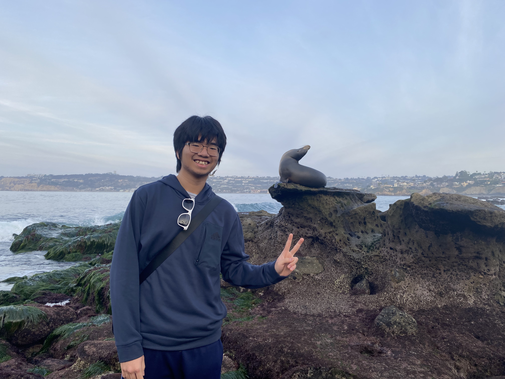

# Everything you need to know about **Nick**
## About me
### Pic

### Gen Info
I like:
1. **Cat**
2. Boba
3. Ben & Jerry's ice cream
4. Playing violin
5. Ghibli studio movies
[This is a relative link to the Ghibli style Geisel Library I used Chat GPT to create](images/Geisel_Ghibli_style.png)

I like to read books and listen to a bunch of podcasts:
- Business
- Personal finance
- Tech podcasts
- NPR Planet Money podcast
- Acquired podcasts
- WSJ podcasts

Favorite motivation quote:
> The discomfort of growth is always less than the heartbreak of regret 
by _Robin Sharma_

These are the first lines of code I learned:
```
public class{
    public static void main(String args[]){
        System.out.println("Hello Wordl!");
    }
 }
```

This is a link to my favorite YouTube Chanel:
[Oversimplified](https://www.youtube.com/oversimplified)

[About me](#about-me)
- [x] Warm up with git
- [x] Create my profile
